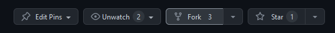
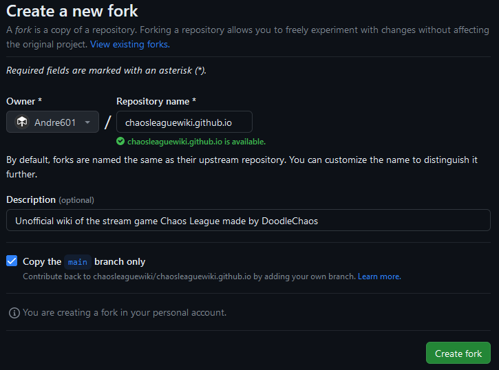

# Contributing

We are always happy for contributions towards this wiki, no matter how big or small they are.  
This file was made to explain the basics of contributing and what we expect from you to do, to have your changes approved and merged into this repository.

## Terminology

The following words and sentences will be used throughout this document.

| Term             | Description                                                                                                                                   |
|------------------|----------------------------------------------------------------------------------------------------------------------------------------------|
| Git              | Open source, distributed version control system. See [git-scm.com][git] for more info.                                                        |
| Fork             | A copy of this repository you made on GitHub. [Learn more about forking a repository][forking].                                               |
| Local repository | Your fork cloned to your PC using the `git clone` command. [Learn more about cloning][cloning].                                               |
| Branch           | Git term used to describe a separate "version" of the repository.                                                                             |
| Commit           | Git term describing the addition of one or multiple changes to a repo's version history.                                                      |
| Pull request     | Method used on GitHub to integrate changes made from a separate branch (and from a fork) into the repo. [About Pull requests][pull-requests]. |
| Pip              | Command included in Python to install and manage python libraries.                                                                            |

[git]: https://git-scm.com
[forking]: https://docs.github.com/en/get-started/quickstart/fork-a-repo
[cloning]: https://docs.github.com/en/repositories/creating-and-managing-repositories/cloning-a-repository
[pull-requests]: https://docs.github.com/en/pull-requests/collaborating-with-pull-requests/proposing-changes-to-your-work-with-pull-requests/about-pull-requests

## Requirements and Prerequisits

Before you start contributing should you make sure to have covered the following points first.

- You have a decent understanding of Git and GitHub including but not limited to...
  - ...knowing how to fork this repo and keep it updated.
  - ...knowing how to clone your fork to a local repository on your PC.
  - ...know how to make new branches, commit changes to it and push these changes to your fork on GitHub
  - ...know how to create Pull requests
- You have basic understanding of how to use Python and MkDocs.
  - MkDocs is the site generator we use for the wiki and it relies on Python 3.10 or newer
  - Knowledge of using the `pip` command including installing dependencies from a file is recommended.

While this document explains the basics of using GitHub, Git and MkDocs, is it still recommended to look up tutorials on these topics to get a better understanding of everything.

## 1. Forking the repository

To make contributions to this repository, you first have to make a Fork of it on your GitHub  Account.  
To do this, navigate to the root of this repository and press the "Fork" button located at the top-right. Note that should you already have a fork, you can click the arrow instead to open a dropdown and select your fork from it.



The default info on the fork page, including the checked "Copy the `main` branch only" option, should all be fine and you can just click "Create Fork".



### Syncing your fork

> [!NOTE]
> This is only required should you have an already existing fork that hasn't been updated in a while. For newly made forks is this not required.

To sync your fork with this one, head to your fork and press the "Sync Fork" button which should be located near the green "Code" button.  
Depending on the state of your repository will you see one of two possible messages:

- "This branch is not behind the upstream `chaosleaguewiki/chaosleaguewiki.github.io:main`"  
  This line means that your fork is up to date with the main repo and that no update is required.
- "This branch is out-of-date"  
  This means that there are changes in the main repo and that a sync is recommended to have the latest changes included in your fork. Confirm a syn by pressing the "Update branch" button.

### Creating a branch

This is a recommended, but not required, step to do.  
Creating a separate branch allows better organization while also keeping the main branch clean, avoiding possible merge conflicts in the future when syncing your fork.

To create a branch, click the button displaying the branch name `main` to open a dropdown. In said dropdown, type in the name of the new branch you want to create in the text field. Any name may work, but recommended branch patterns are...

- `feature/description` for new features (i.e. added pages). Example: `feature/add-v1.0-changelog`
- `fix/description` for fixes of any kinds, including typo corrections. Example: `fix/typo-in-links`

To now create a branch, click the text reading "**Create branch: [branch]** from 'main'" where `[branch]` is the name of the branch you typed.  
This will create a new branch that is based on the current state of your main branch.

## 2. Clone the Repository to PC

> [!IMPORTANT]
> This requires to have Git installed on your PC. Should you use Windows can you install [Git for Windows][git-for-windows].  
> [Downloads for other platforms exist too!][git-download]

[git-for-windows]: https://gitforwindows.org/
[git-download]: https://git-scm.com/download/

Cloning the repository onto your PC using Git is recommended, as it can allow faster editing of multiple files, as well as easier adding of new files.

To clone the repository to your PC, first choose a folder where the repository would be copied into. Note that a new folder named after the repository will be created in it through the clone command.  
To now clone your fork, open the Git Bash Terminal and execute the follwing command, after replacing `YOUR_NAME` with the Username where the fork exists on.
```sh
git clone https://github.com/YOUR_NAME/chaosleaguewiki.github.io.git
```
This should clone the repository into a new folder named `chaosleaguewiki.github.io`. If you want a different name can you add a folder name after the URL to use that.

> [!NOTE]
> Should you have made a separate branch will you need to switch to it before making any changes.  
> To do this, run the following command in the Git Bash Terminal (Replace `<branch>` with your branch name):  
> ```sh
> git switch <branch>
> ```

## 3. Make and commit changes

Now that you have cloned the repository to your PC (And maybe also switched or made a new branch for it) can you start making your changes...  
The overall structure of the different pages on the wiki are explained in the [`Wiki Structure`](#wiki-structure) section further down in this document.

Once you've made the changes you want, you have to commit them, creating proper records in the commit history of Git and GitHub.  
Depending on your Git configuration will you first need to execute the following command:
```
git add <file>
```
`<file>` would be a file-path relative to the root of your local repository. You can use `.` here to tell git to add any changed file.

If you're unsure if changes got added can you use `git status` which could give you an output similar to the following:
```sh
$ git status
on branch your-branch-here
Your branch is up to date with 'your-branch-here'.

Changes to be committed:
  (use "git restore --staged <file>..." to unstage)
        modified:   CONTRIBUTING.md
```

Should your files be properly added can you commit them.  
Committing them in git can be done using the `git commit` command. Just executing the command as-is will open the text editor set for git to use, prompting you to add a commit message to use. It is recommended to add a simple, yet informative message, telling us what was done.  
Alternatively can you append the `-m` option followed by the commit message in single or double quotes to set a commit message without opening a text editor.

Your changes should now be committed and only need to be pushed back to your fork on GitHub.

## 4. Push to fork

Now that you've made and committed your changes should you push them back to your fork on GitHub.  
This is as easy as just executing `git push` in the Git Bash Terminal.

> [!CAUTION]
> There are issues with pushing changes from your local repo to one hosted on a organization account. GitHub may give insufficient permission errors, even when you have write permissions.  
> A workaround is to use [GitHub Desktop][github-desktop] to do the pushes.
>
> On another note is there an issue with GitHub Desktop and commit signing. Should you have enabled commit signing with a GPG key can GitHub Desktop not perform any commits. You have to do them through the Git Bash Terminal.

[github-desktop]: https://desktop.github.com/

## 5. Create Pull request

A final step you should do now is create a Pull request on our repository. GitHub should already inform you about unmerged changes with a button to create a Pull request. If no such prompt is shown can you simply go to our Pull requests tab and press "New pull request".

In the new window will you have a comparison between the target branch and changes you want to add. Make sure that `base repository` is set to `chaosleaguewiki/chaosleaguewiki.github.io` and that `base` is set to `main`.  
Should there only be a `base` without any `base repository` dropdown are you currently viewing a comparison between branches of the same repository. To fix that, click the text reading "compare across forks".

On the right side, make sure `head repository` is set to the fork you have and `compare` is set to the branch with the changes you made.  
Should there be mergable changes between the branches will the "Create pull request" button light up and you can click it to start making a Pull request.

In the Pull request window, add an easy to understand title and a informative description about the reasons for the changes and what changes you have made. Should the Pull request be made to fix an existing issue on our issue tracker can you add `closes #<id>` where `<id>` would be the Issue ID, to have the issue automatically closed when the Pull request gets merged.

All that is left to do is press the green button to create your Pull request.

Congratulations! You successfully made a contribution to the wiki!

----

## Wiki Structure

The wiki contains various pages, each having their own specific structure you should follow when adding or editing pages for it. This section covers the most important things about each type of wiki page.

### Using live preview

> [!NOTE]
> This requires to have Python 3.10+ installed and also all necessary dependencies.  
> Once you have installed Python can you execute `pip install -r requirements.txt` in the root of your repository to download all required dependencies.

MkDocs is used as the generator to create the static pages you can read. It comes with a live preview option, allowing to modify pages and see the changes being applied quickly.  
To enable the live preview, open the root of your local repository in Git Bash Terminal and type `mkdocs serve`. This will start a live preview on `127.0.0.1:8000` that you can open in your browser to see.

To stop the live preview press <kbd>Ctrl</kbd> + <kbd>C</kbd> in the Git Bash Terminal to stop the programm.

### What you should do when adding pages

Any Markdown page in the wiki that you add needs to also be included in the navigation.  
To do that, open the `mkdocs.yml` file located in the root of this repository and head to the `nav` setting in it. This setting defines the navigation to use for MkDocs, as well as actually tell it what pages exist.

Be sure to keep the format (indents) the same. Also, make sure that the pages themself are sorted alphabetically in their respective sub-section.  
This means, if you add a new minigame page called `example.md` to the `commons` section while there are `bounce-house.md`, `danger-zone.md` and `quip-battle.md` would you add it after `bounce-house.md` and `danger-zone.md` but before `quip-battle.md` in the nav.

The only exception to the above rule are `index.md` pages, which should **always** be the first entry in a sub-section.

Also, please note that all pages need to be lowercased and only use alphanummeric characters and hyphens (`a-z`, `0-9` and `-`). Spaces are not allowed in file names.

### Minigame pages

Minigame pages can be found either in `twitch-minigames` or `youtube-minigames` where they are further split up into folders matching their rarity.  
A bare-bone minigame page should have the following content:

- YAML frontmatter containing a `description` property, holding the first line of the page content (Without any markdown formatting).
- A H1 header as the very first line after the YAML frontmatter
  - Only exception is when there is a YouTube or Twitch variant of this game in which case the [`{{ game.yt_variant(path) }}`][game.yt_version] or [`{{ game.twitch_version(path) }}`][game.twitch_version] would come first after the YAML frontmatter before the H1 header.
- The [`{{ game.info(...) }}`][game.info] macro containing information about this game.
  - Note: This macro is designed for Gen 3 minigames. Old game pages, namely youtube versions, may not work with this macro and require manual implementation of the info box. Check an existing page for the design.
- The page content itself, including a `Gameplay` H2 header explaining the game mechanics.
- The [`{{ game.history(...) }}`][game.history] macro containing the changes to the game, including its initial addition to Chaos League.

Should the game also not be released yet, are you required to add a `--8<-- "unreleased.md"` right after the H1 header to insert a banner informing about the displayed content not being released yet and any info most likely being inaccurate or outdated.

Here is a complete example using a fictional game named `Example`:
```markdown
---
description: Example is a common example minigame where players do stuff.
---

{{ game.yt_version("common/example/") }}

# Example

--8<-- "unreleased.md"

{{ game.info(
  slots_guaranteed = "8",
  slots_raffle     = "8"
) }}

**Example** is a common example minigame where players do stuff.

## Gameplay

Players do stuff. The end.

{{ game.history(
  'v1.0': [
    'Minigame Added'
  ],
  'v1.1': [
    'Some bug fixes'
  ]
) }}
```

You also need to add the link to this page to the `games.md` file located in the `.snippets` folder. The pattern is always `[<name>]: /twitch-minigames/<rarity>/<page>/` where `<name>` is the actual name of the game, including capitalization, spaces, etc., `<rarity>` is the rarity (folder) the page is located in and `<page>` is the file name without the `.md` extension.

[game.info]: https://chaosleaguewiki.github.io/meta/macros/game/#game.info
[game.history]: https://chaosleaguewiki.github.io/meta/macros/game/#game.history
[game.yt_version]: https://chaosleaguewiki.github.io/meta/macros/game/#game.yt_version
[game.twitch_version]: https://chaosleaguewiki.github.io/meta/macros/game/#game.twitch_version

### Game Mechanics

Game mechanics pages have a simpler structure than Game pages. With that said do they also follow a specific structure and include additional macros.  
One macro used is [`{{ image.right(...) }}`][image.right] which adds an image to the right side of the page with an optional title, caption and alt text.

It is recommended to put this macro after a header of where it should be.

The [`{{ game.history(...) }}`][game.history] macro is also used here and also put at the very bottom of the page.

[image.right]: https://chaosleaguewiki.github.io/meta/macros/image/#image.right

### Commands

Commands for the twitch version are all located in one file: `chat-commands/twitch.md`

This means that instead of adding a new page, you simply add a new section with the command. Make sure that said section is in the right category (Currently "Global Commands", "Throne Commands" or "Tile Commands").  
The header (which should be a H3 one) should contain the complete syntax of the command, meaning if the command syntax is `!cmd @user [points]` then the header would be the same. Should there be any arguments in the command, meaning it isn't just `!cmd`, you have to a `{ #<id> }` at the end of the header with `<id>` being the command name without the `!`.

Example:
```markdown
### `!cmd @user [points]` { #cmd }
```

Should a command be removed from Chaos League should you **not** remove it. Instead, add the following right after the header:
```markdown
/// removed | Command removed in <version where it got removed>
///
```

This will add a banner informing about the removal.

You also should add the command to the `commands.md` file located in the `.snippets` folder. The format is always `[<name>-command]: /chat-commands/twitch/#<name>` where `<name>` is the Header ID used.

### Changelogs

The changelog page is special in that the displayed changelogs are from separate files. This helps us to keep things organized.

The changelog files themself are located in `changelog/cl3/` and always named after the version they are about (i.e. `v0.1-alpha.md` for the `v0.1 Alpha` release).  
There is also a `.template.md` file available that can be used to make a new changelog entry. It contains all necessary content and looks like this:
```markdown
---
weight: 100 # Change this number to the currently highest one +1.

title: v0.100 Alpha # Change this to the actual version this changelog is about.
---

`v0.100 Alpha` was released January 1st, 2100

----

{{ utils.table({
  'Added': [
    '',
    ''
  ],
  'Changed': [
    '',
    ''
  ],
  'Fixed': [
    '',
    ''
  ],
  'Removed': [
    '',
    ''
  ]
}) }}
```

To use the file, simply copy it, rename it to the version you want to add and change the following values:

- `weight` should be changed to the highest value not used yet. This means if the latest release in the changelog list uses weight 10, yours should be 11.
- `title` and `v0.100 Alpha` in the page content should be changed to the current changelog version.
- `January 1st, 2100` should be changed to the date on when the changelog has been published by DoodleChaos on Discord (Which is usually followed by a stream of this version). The timezone for the date is CET/CEST.

The [`{{ utils.table(...) }}`][utils.table] macro is used to generate a table, not unlike the one used in the [`{{ game.history(...) }}`][game.history] macro.  
When adding entries to the different parts, make sure to escape any single quotes in the text, meaning something like `you're` becomes `you\'re`. If you don't escape these, will errors appear.

Also, make sure to remove any unused entries and sections.  
This means that this:
```
{{ utils.table({
  'Added': [
    'Something.',
    'Added'
  ],
  'Changed': [
    '',
    ''
  ],
  'Fixed': [
    'Critical Bug',
    ''
  ],
  'Removed': [
    '',
    ''
  ]
}) }}
```
turns into this:
```
{{ utils.table({
  'Added': [
    'Something.',
    'Added'
  ],
  'Fixed': [
    'Critical Bug'
  ]
}) }}
```

[utils.table]: https://chaosleaguewiki.github.io/meta/macros/utils/#utils.table

### Other files

Depending on what files you add or change are you required to follow certain rules and requirements.

As of right now are only images of minigame and shop tiles bound to such requirements, namely such an image needs to follow these rules:

- The area depicted only includes the tile itself without the queue and prize sign
- The tile needs to be empty. Currently active tiles are not to be used for screenshots
- The tile on the left is being screenshoted. This is to avoid the "Development Build" text on the bottom right corner from being included.

Here are some examples:

| Good            | Bad (Queue and Prize sign visible) | Bad (Players in game)  | Bad (Right side screenshotted) |
|-----------------|------------------------------------|------------------------|--------------------------------|
| ![good example] | ![bad example queue]               | ![bad example players] | ![bad example dev build text]  |


[good example]: .github/contributing/image_good_example.png
[bad example queue]: .github/contributing/image_bad_example_queue.png
[bad example players]: .github/contributing/image_bad_example_players.png
[bad example dev build text]: .github/contributing/image_bad_example_dev_build_text.png


