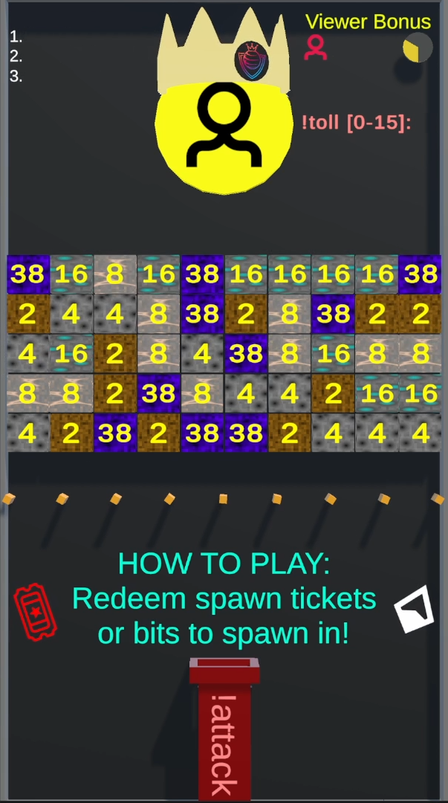

# Attacking the King

/// wiki | Attacking the King
    attrs: {class: 'inline end'}

///

The main goal of the game is to attack the king and take the throne for yourself.

To attack the king, the player has to execute [`!attack`][attack-command] while not currently spawned in, to spawn at the pipe in the middle with the `!attack` text on it.  
Their marble will move upwards to the block wall that protects the king.

## Wall

The wall consists of different types of ore blocks: Coal, Iron, Gold and Diamond. Each block has a different defense value, that can be higher or lower depending on how fast the previous capture of the throne was done.  
In addition are 10 obsidian blocks randomly spread across the wall. Each obsidian block starts with a base value, that then receives 1/20th of the players points during the throne capture. As an example, a player who captures the throne with 1,000 points remaining will give each block `50` points (`1,000 / 2 / 10` or `1,000 / 20`).  
Finally can a player also give points to spread across the 10 obsidian blocks by using the [`!defend [amount]`][defend-command] command.

Whenever an attacking marble touches a block will its value decrease at the same rate the player's points do. Once it reaches zero will the block be removed.  
Should a player's points reach zero will their marble be eliminated.

The wall only regerenates when a player captures the throne.

## Trivia

- A player with zero points will still take away one point from the block their marble touches, before it gets eliminated.

{{ game.history({
    'v0.1 Alpha': [
        'Gameplay mechanic added'
    ],
    'v0.30 Alpha': [
        'Gold Ore block now give the attacking player gold when it gets broken by them. Texture was also changed'
    ],
    'v0.35 Alpha': [
        'Added camera movement to emphasise the throne capture'
    ]
}) }}