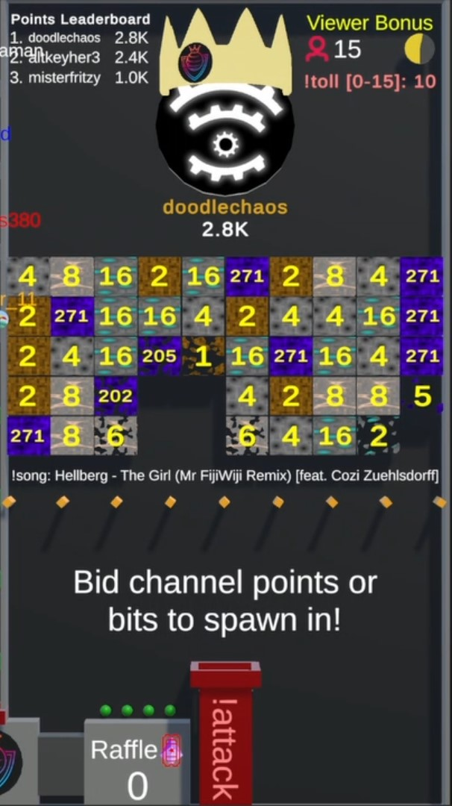

# Attacking the King

/// wiki | Attacking the King
    attrs: {class: 'inline end'}

///

A core mechanic (And the main goal) of Chaos League is to attack the king and capture the throne.

To attack the king, a player has to use the `!attack` command. This will spawn the Player's Marble at the red pipe with the `!attack` text on it.  
The Marble will move up towards the current king. During their move will they encounter a wall of ore blocks. Each block has a value corresponding to their type; dirt has 2, coal has 4, iron has 8 and diamond has 16.  
The obsidian blocks vary in their values, as the king can use the `!defense [amount]` command to spread `[amount]` of their score on 10 obsidian blocks.

Each block the Player's Marble touches will decrease in value while also decreasing the player's score at the same rate. Should the player's score reach 0 before they captured the throne will they be eliminated.  
Broken blocks remain broken until a player has captured the throne, at which point the wall will be regenerated.