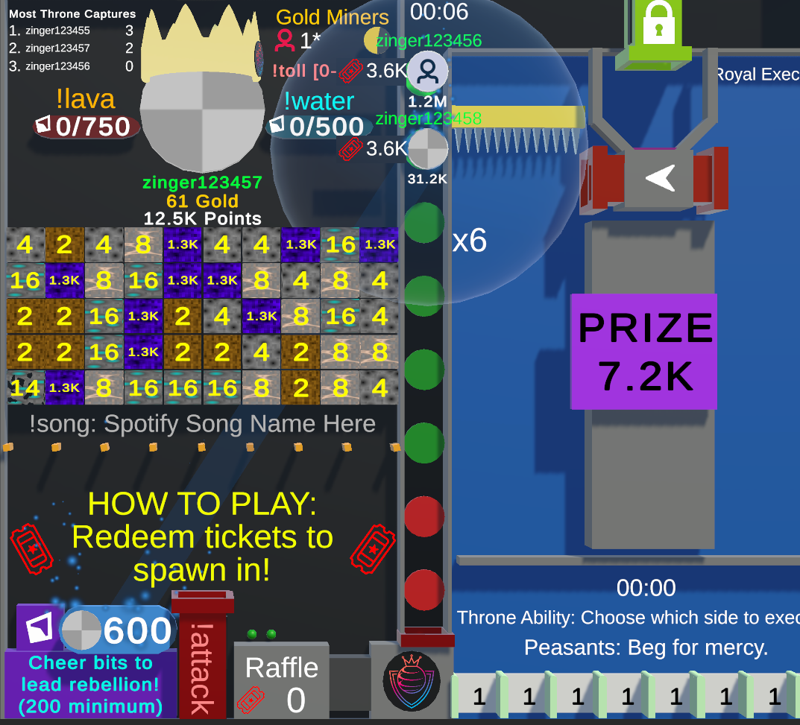
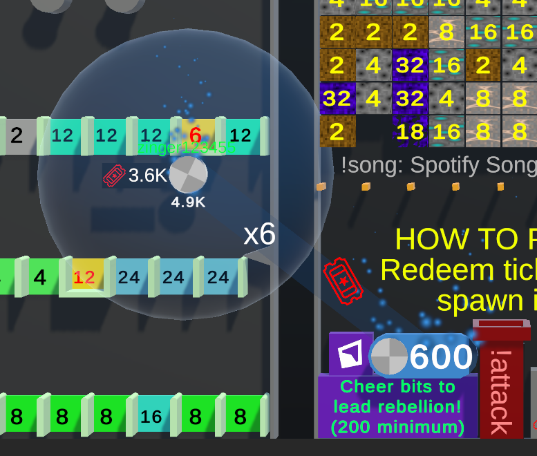

# Rebellion

/// wiki | Rebellions
    attrs: {class: 'inline end'}

///

Rebellion is a game mechanic where people can give bits to start a multiplier that increases points earned amongst other effects.

## How it works

Players can use the [`!rebel [bits]`][rebel-command] command where `[bits]` is a cheer of at least 200 bits to start a rebellion. Once a rebellion starts will a circle appear around the player that started it. This circle will have certain effects on tiles and other mechanics. See the [Effects section](#effects) for details.

The default multiplier starts at 2, but increases by one with every addition 100 bits added. In addition is the duration of the rebellion also increased.

## Effects

/// wiki | 
    attrs: {class: 'inline end' }

  
<small>Image showing the effect the rebellion has on gaps in [How Low Can You Go].</small>
///

The circle around the rebellion starter has specific effects on players, tiles and other mechanics, depending on the situation. Players need to be inside the circle to receive the effects.

### Bidding spawn tickets

When a player bids spawn tickets to participate while in the effect area of the rebellion leader will the tickets they spent be multiplied. This will also affect the prize a player can win on a tile.

Should the rebellion leader not be king and not participate will their effect area be at the spawn pipe for the queue, affecting every bid made that spawns the player in the queue itself.

### Point gaps

Gaps giving or taking points have their values multiplied while in the effect area of the rebellion leader.

Skull gaps in [Zero or Hero] also turn into Angel gaps. These gaps do not take away any points from the player while still eliminating them.