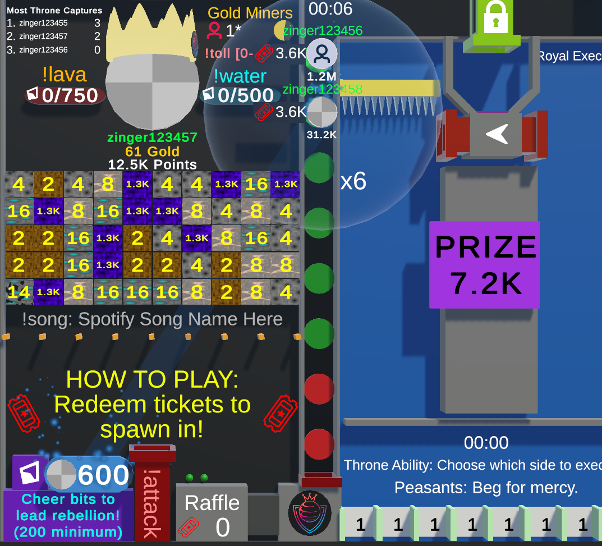

# Rebellions

--8<-- "unreleased.md"

/// wiki | Rebellions
    attrs: {class: 'inline end'}

///

Rebellion is an upcoming game mechanic where people can double the points earned for a brief moment.

## How it works

Players can use the `!rebellions` command alongside a bits amount to start a rebellion. Once a rebellion starts will every player participating in minigames earn twice the points they usually do for the time the rebellion is active.