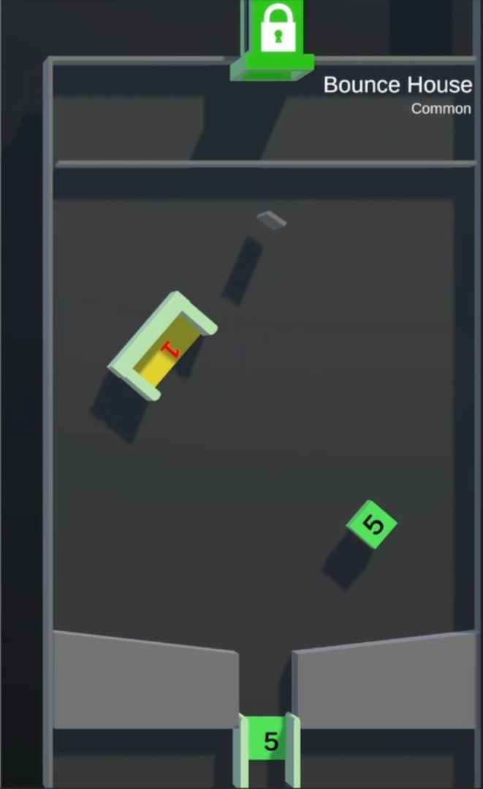

# Bounce House

/// wiki | Minigame Info
    attrs: {class: 'inline end'}

|         |                               |
|---------|-------------------------------|
| Rarity: | Common                        |
| Input:  | None                          |
| Timer:  | None                          |
| Rounds: | None                          |
| Slots:  | Guaranteed: 8 Raffle: 8    |

///

*Bounce House* is a game where players are released into the arena where they are thrown around, hitting different objects.

## Gameplay

Once released, the player's Marble will be thrown around by two moving tiles at the bottom. At the same time is a block with a point value and a "bowl" with a point value rotation around the center of the arena.  
Should the player hit the block, will the point value on it be added to their score. Should they hit the bowl, will the displayed point value be added to their score and their Marble gets eliminated.

At the bottom-center of the arena is a Gap. Said gap has a point value too, which when the player falls through it, will be added to their score. Should the Player's Marble fall through the gap, will they re-appear at the pipe located at the top of the arena.

The game is over once one player Marble is left.