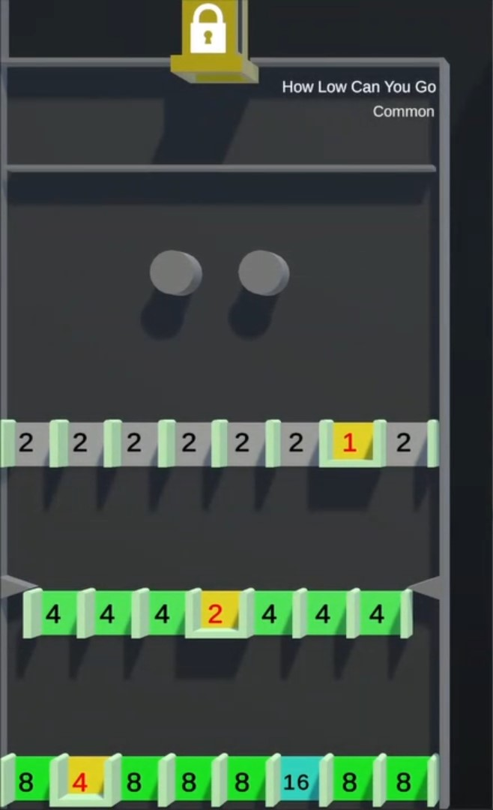

# How Low Can You Go

/// wiki | Minigame Info
    attrs: {class: 'inline end'}

|         |                                |
|---------|--------------------------------|
| Type:   | Automatic (No input required)  |
| Timer:  | None                           |
| Rounds: | None                           |
| Slots:  | Guaranteed: 8 Raffle: 4     |

///

*How Low Can You Go* is an automatic Game, where players are put into the Arena and fall down.

## Gameplay

The arena has numbers of rows with gaps in them. Depending on the rarety of the game will there be less rows, but with much higher point values.  
Some gaps are closed of at the bottom. Should the player's Marble end up in this gap will they be eliminated.

Slots may display a number. If the player's Marble falls through such a slot will the number be added to their score. Once they fall through the gaps at the very bottom will they come back out at the pipe located at the top of the arena.

The game is over once one player Marble is left.