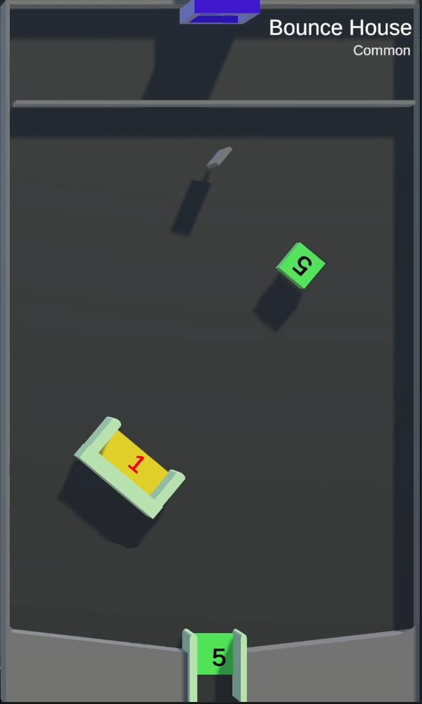

# Bounce House

/// wiki | Bounce House
    attrs: {class: 'inline end'}

|         |               |
|---------|---------------|
| Rarity: | Common        |
| Input:  | None          |
| Timer:  | None          |
| Rounds: | None          |
| Slots:  | Guaranteed: 8 |
|         | Raffle: 8     |
| Added:  | v0.3 Alpha    |

///

**Bounce House** is a common minigame added in version v0.3 Alpha. It is based on the YouTube version's tile of the same name.

## Gameplay

The tile consists of a 5 points block and an elimination bowl rotating around it's center and 2 moving structures with a 5 points gap between them. Just under the pipe, there's a small, rotating rectangle.

The participating players' marbles are dropped and begin to fly around the tile, launched by the moving structures. If a marble touches the green block, 5 points are added to it's balance. If a marble falls through, 5 points are added to it's balance and it appears back in the game through the pipe at the top. If a marble gets into the rotating bowl, it is eliminated from the game, and 1 point is transfered to the king's balance.

When there's one marble left, the game ends, and the players are ranked by their elimination order. The longest surviving player wins.

## See also

- Bounce House - YouTube version

/// wiki | History
|            |                |
|------------|----------------|
| v0.3 Alpha | Minigame added |
///
