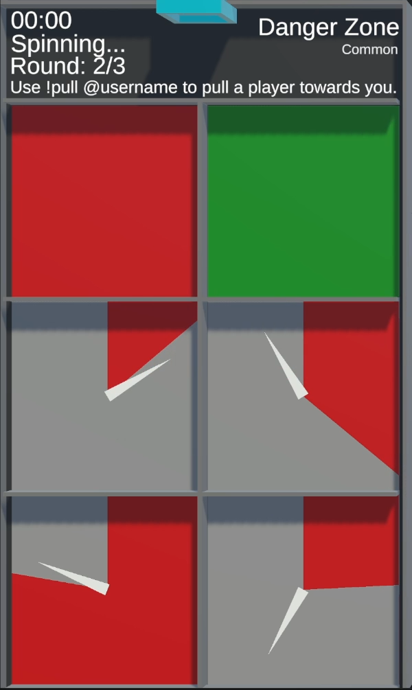

# Danger Zone

/// wiki | Danger Zone
    attrs: {class: 'inline end'}

|         |               |
|---------|---------------|
| Rarity: | Common        |
| Input:  | Commands      |
| Timer:  | 20 Seconds    |
| Rounds: | 3             |
| Slots:  | Guaranteed: 8 |
|         | Raffle: 4     |
| Added:  | v0.1 Alpha    |

///

**Danger Zone** is a common minigame added in version v0.1 Alpha.

## Gameplay

The tile consists of 6 chambers.

At the beginning of each round, the participating players' marbles are distributed evenly between the chambers. For 20 seconds, the players gain the ability to pull other players' marbles to their marble by typing `!pull @username`. It is possible to pull several marbles at once.

When the timer is up, the pulls are executed for 4 seconds. Marbles in green chamber are safe. Marbles in red chamber are eliminated. In the remeaning chambers, a needle is spinned. If it points at the red area, the marbles are eliminated, otherwise they are safe.

When there's no marbles or one marble left, or after 3 rounds, the game ends, and the players are ranked by their elimination order. The longest surviving player wins. It is possible for several players to get the same rank.

/// wiki | History
|            |                |
|------------|----------------|
| v0.1 Alpha | Minigame added |
///
