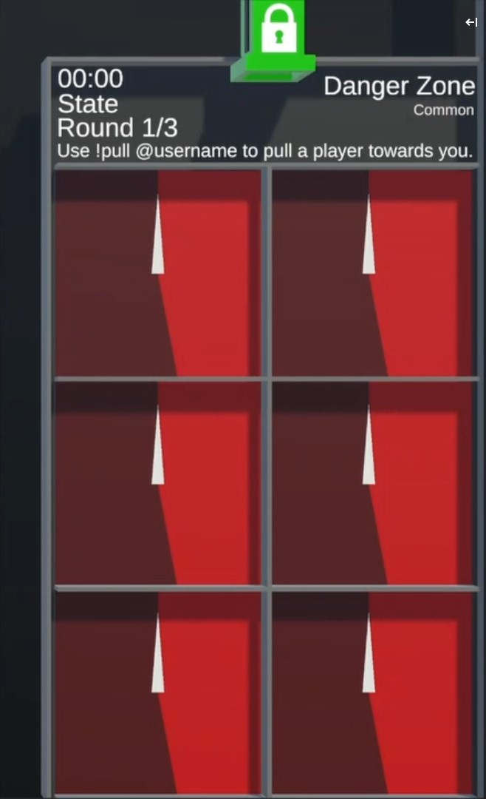

# Danger Zone

/// wiki | Danger Zone
    attrs: {class: 'inline end'}

|         |                            |
|---------|----------------------------|
| Rarity: | Common                     |
| Input:  | Command                    |
| Timer:  | 20 Seconds                 |
| Rounds: | 3                          |
| Slots:  | Guaranteed: 3 Raffle: 4 |

///

**Danger Zone** is a game where players pull each other into one of 6 zones and maybe get eliminated.

## Gameplay

Player marbles are droped into the arena, which is split up into 6 squares.  
Each square is split into a red and gray area. There are also two special squares, one which is completely red and one which is completely green.

During the countdown in a round can each player use `!pull @user` (`@user` being a mention of a player in the game) to pull a player's marble towards their own. Once the countdown is over will each marble be pulled towards others, depending on who pulls who (A player can be pulled by multiple others).

After each player has been moved will walls split up the squares, before a needle inside each square starts to spin. Should the needle end up on the red area of the square will every player inside it be eliminated.  
Player marbles inside the fully red square are directly eliminated and players inside the green square are safe.

Once the round is over will the remaining players be moved into a different square and the next round starts, repeating with the countdown and command again.

The game is over once 3 rounds pass, or once all, or all but one player are eliminated.