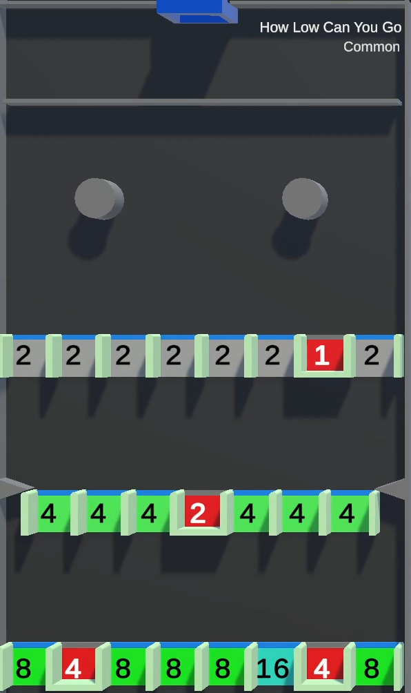

# How Low Can You Go

/// wiki | How Low Can You Go
    attrs: {class: 'inline end'}

|         |               |
|---------|---------------|
| Rarity: | Common        |
| Input:  | None          |
| Timer:  | None          |
| Rounds: | None          |
| Slots:  | Guaranteed: 8 |
|         | Raffle: 4     |
| Added:  | v0.1 Alpha    |

///

**How Low Can You Go** is a common minigame added in version v0.1 Alpha. It is based on the YouTube version's [tile of the same name](../../youtube-minigames/common/how-low-can-you-go.md).

## Gameplay

The tile consists of 2 circles moving horizantally, below which there are 3 rows with several gaps.

The participating players' marbles are dropped and begin to collect points by falling through the gaps. If a marble falls through the last row, it appears back in the game through the pipe at the top. If a marble falls into a closed gap, it is eliminated from the game and a given number of points is transfered to the king's balance.

When there's one marble left, the game ends and the players are ranked by their elimination order. The longest surviving player wins.