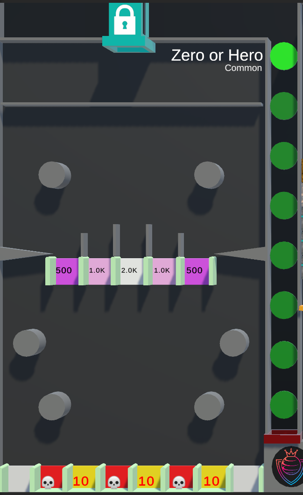

# Zero or Hero

--8<-- "unreleased.md"

/// wiki | Zero or Hero
    attrs: {class: 'inline end'}

|         |                |
|---------|----------------|
| Rarity: | Common         |
| Input:  | None           |
| Timer:  | None           |
| Rounds: | None           |
| Slots:  | Guaranteed: 8  |
|         | Raffle: Unknwn |
| Added:  | v0.9 Alpha     |

///

**Zero or Hero** is a common minigame added in v0.9 Alpha. It is based on the YouTube version with the same name.

## Gameplay

The tile has two moving circles, followed by a row of gaps with point values, four moving circles and finally another row of gap, with all but two being closed of.

The player's Marble will be released from the top falling down to the first row of gaps. These gaps have point values of 500, 1,000 and 2,000 assigned. Passing one will give the player the displayed point value.

After passing these gaps will the Marble encounter a second row of gaps at the bottom. This row has more gaps, but at the same time are all but two gaps (one on each side) closed of. The closed gaps alternate between one with a skull icon and one with a number value of 10.  
Should the player's Marble end in a gap with a skull icon will they be eliminated. Should they end in a gap with the number value will said number be transferred from their score to the current king's score.

The game ends once only one Marble is left. The players will be ranked by time survived.

## See also

- Zero or Hero - YouTube version

/// wiki | History
|            |                |
|------------|----------------|
| v0.9 Alpha | Minigame added |
///