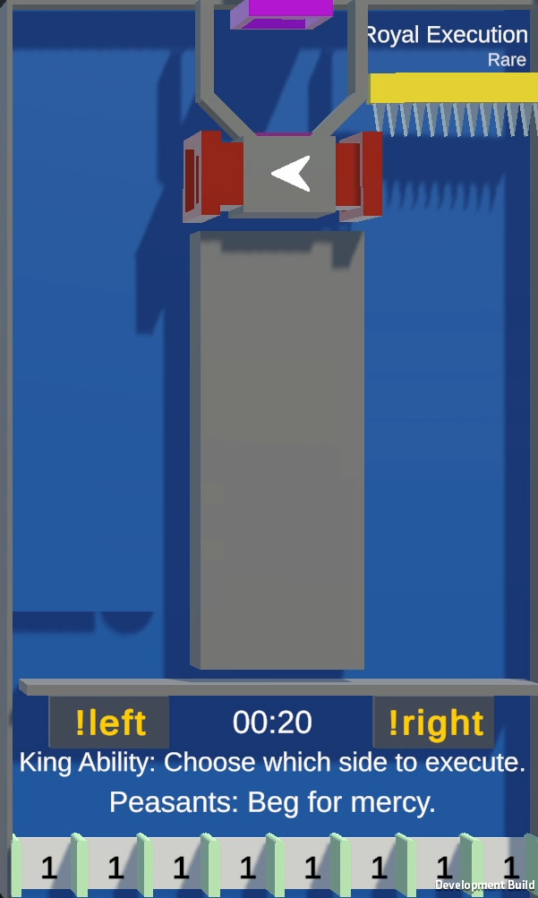

# Royal Execution

--8<-- "unreleased.md"

/// wiki | Royal Execution
    attrs: {class: 'inline end'}

|         |                         |
|---------|-------------------------|
| Rarity: | Epic                    |
| Input:  | King: `!left`, `!right` |
| Timer:  | None                    |
| Rounds: | None                    |
| Slots:  | Guaranteed: Unknown     |
|         | Raffle: Unknown         |
| Added:  | TBD                     |

///

**Royal Execution** is a epic minigame that will be added in a future alpha version.

## Gameplay

The tile is split up into a left and right area by a large wall. Player Marbles will be droped into either side at random through a funnel area ending in two pipes at the top.  
The current King will then be able to use `!left` or `!right` to lover a spike wall either on the left or right side respectively, eliminating all players on said side and adding 4 of their points each to the King's balance.  
After this will the remaining players be dropped, where they fall through gaps which gives them points based on their displayed number.

The game is over once all, or all but one player got eliminated.

/// wiki | History
|     |                    |
|-----|--------------------|
| TBD | Minigame was added |
///