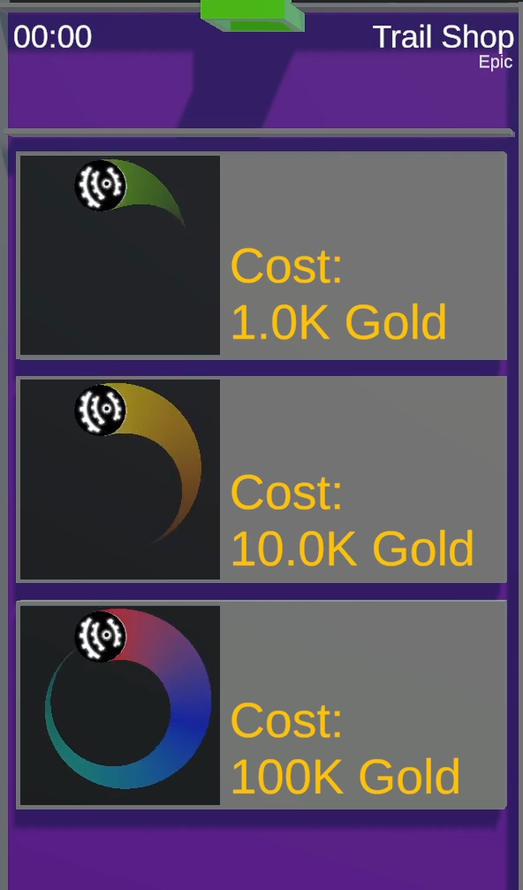

# Trail Shop

/// wiki | Trail Shop
    attrs: {class: 'inline end'}

|         |                               |
|---------|-------------------------------|
| Rarity: | Epic                          |
| Input:  | [`!buy` command][buy-command] |
| Timer:  | 29 Seconds                    |
| Rounds: | N/A                           |
| Slots:  | Guaranteed: 8                 |
|         | Raffle: N/A                   |
| Added:  | v0.12 Alpha                   |

///

**Trail Shop** is a special tile in that it is not a minigame in the usual sense, but a shop players can buy trails from using their earned Gold.

## Gameplay

The tile is split up into three sections, each showing a preview of a trail the player can buy.

From top to bottom do the trails increase in prize while also being larger in length and having more colors with the top having only one color and being the shortest and the bottom one having three colors and being the longest trail.

Once the game starts can each player use the [`!buy<number>` command][buy-command] where `<number>` is a number between 1 and 3, matching one of the displayed trails. If the player has enough gold to purchase the trail, will their marble be moved to the trail before moving towards the bottom center of the screen with the new trail applied.

The colors a trail can have are randomly chosen whenever the tile is being selected. Previously purchased tiles can't be re-equipped again.

[buy-command]: ../../chat-commands/twitch.md#buynumber