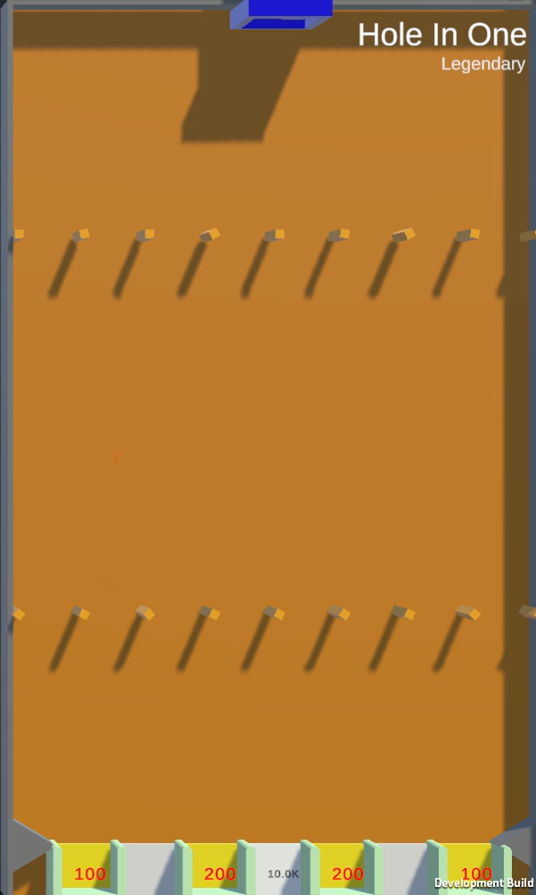

# Hole In One

/// wiki | Hole In One
    attrs: {class: 'inline end'}

|         |               |
|---------|---------------|
| Rarity: | Legendary     |
| Input:  | None          |
| Timer:  | None          |
| Rounds: | None          |
| Slots:  | Guaranteed: 8 |
|         | Raffle: 8     |
| Added:  | v0.1 Alpha    |

///

**Hole In One** is a legendary minigame added in version v0.1 Alpha. It is based on the YouTube version's tile of the same name.

## Gameplay

The tile consists of 2 rows of small rotating squares, below which there is one row of gaps.

The participating players' marbles are dropped. Points can only be obtained by falling in the middle gap, which adds 10000 of them to player's balance. The two gaps neighboring the middle one, as well as the outside gaps, are closed. If a marble falls into either of them, it is eliminated from the game, and the 100 or 200 points are transfered to the king's balance. There are 2 gaps that have no effect on the marble. If a marble falls through one of them or through the middle gap, it appears back in the game through the pipe at the top.

When there's one marble left, the game ends, and the players are ranked by their elimination order. The longest surviving player wins.

## See also
- Hole In One - YouTube version

/// wiki | History
|            |                     |
|------------|---------------------|
| v0.1 Alpha | Minigame added      |
| v0.6 Alpha | Closed outside gaps |
///
