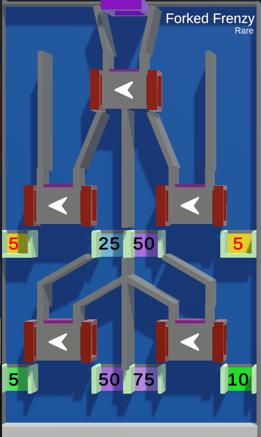

# Forked Frenzy

--8<-- "unreleased.md"

/// wiki | Forked Frenzy
    attrs: {class: 'inline end' }

|         |                 |
|---------|-----------------|
| Rarity: | Rare            |
| Input:  | Unknown         |
| Timer:  | Unknown         |
| Rounds: | Unknown         |
| Slots:  | Guaranteed: N/A |
|         | Raffle: N/A     |
| Added:  | Unknown         |

///

**Forked Frenzy** is an upcoming game where players fall through multiple sets of forking pipes.

## Gameplay

The tile is split up into multiple sets of forking pipes, 1 at the top, 2 in the middle and 2 at the bottom. The player marbles are dropped into the first pipe at the top where they will be split up equally towards the left and right.  
On the second pipe will they be split up again, this time falling through gaps holding different point values they either earn or lose when passing through. Finally will they reach another pipe to be split up again, where they fall through a final gap, before appearing back up at the top, repeating the cicle until the time is over.