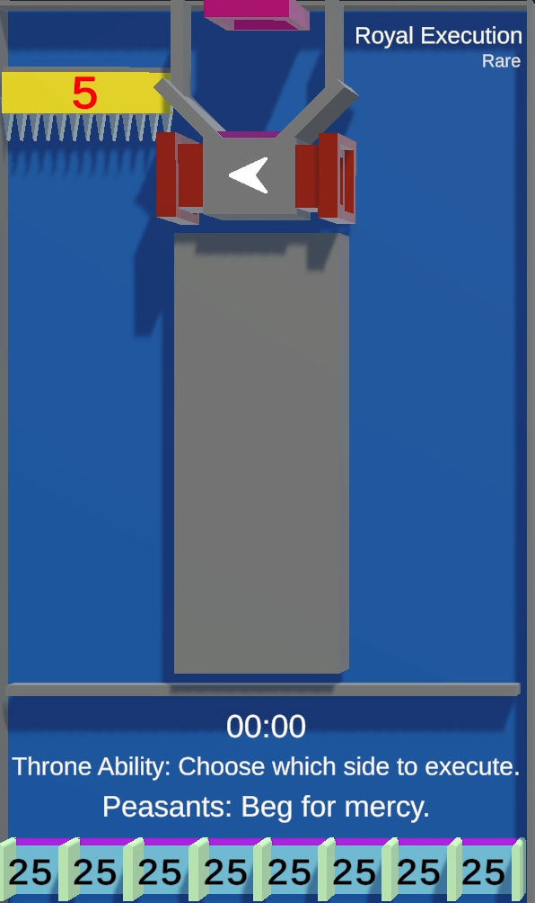

# Royal Execution

/// wiki | Royal Execution
    attrs: {class: 'inline end'}

|         |                                                          |
|---------|----------------------------------------------------------|
| Rarity: | Rare                                                     |
| Input:  | King: [`!left`][left-command], [`!right`][right-command] |
| Timer:  | 30 Seconds                                               |
| Rounds: | Up to 3                                                  |
| Slots:  | Guaranteed: 6                                            |
|         | Raffle: 2                                                |
| Added:  | v0.8 Alpha                                               |

///

**Royal Execution** is a a rare minigame added in version v0.8 Alpha.

## Gameplay

The tile consists of 2 chambers separated vertically and a segregator below the entrance, splitting the participating players' marbles evenly between the two chambers.

Above one of the chambers there is a spiked platform. For 20 seconds, the king gains the ability to move the platform between the chambers using the [`!left`][left-command] and [`!right`][right-command] commands. When the timer is up, the platform is dropped, the marbles underneath transfer 4 points to the king's balance and are eliminated from the game.

When there's one marble left, the game ends and the players are ranked by their elimination order. The longest surviving player wins. It is possible for several players to get the same rank, however, only one person can win.
