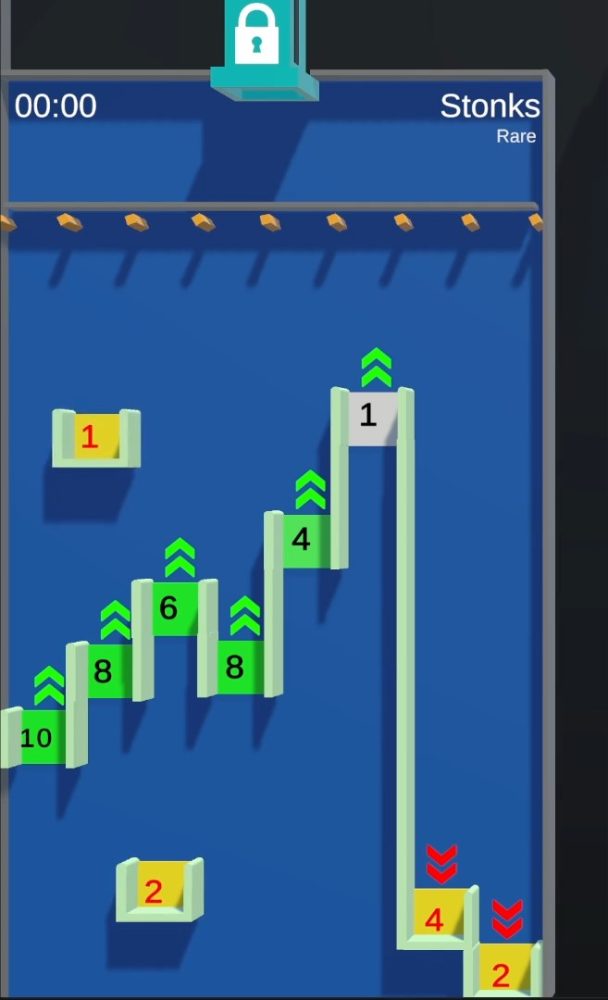

# Stonks

--8<-- "unreleased.md"

/// wiki | Stonks
    attrs: {class: 'inline end'}

|         |                            |
|---------|----------------------------|
| Rarity: | Rare                       |
| Input:  | N/A                        |
| Timer:  | N/A                        |
| Rounds: | N/A                        |
| Slots:  | Guaranteed: 5 Raffle: 4 |
| Added:  | v0.6 Alpha                 |

///

**Stonks** is a minigame added in v0.6 Alpha of Chaos League.

## Gameplay

The Player Marbles are droped into the tile, where they can fall through different gaps with point values assigned. Gaps which aren't closed at the bottom will add their displayed value to the player's score after which they increase their own value by a specific number.

If a player lands in a closed gap will they be eliminated and the displayed value removed from their score. After this the value will be increased.

The game is over once all but one player got eliminated.

/// wiki | History
|            |                                    |
|------------|------------------------------------|
| v0.6 Alpha | Stonks added to the Rare Minigames |
///
