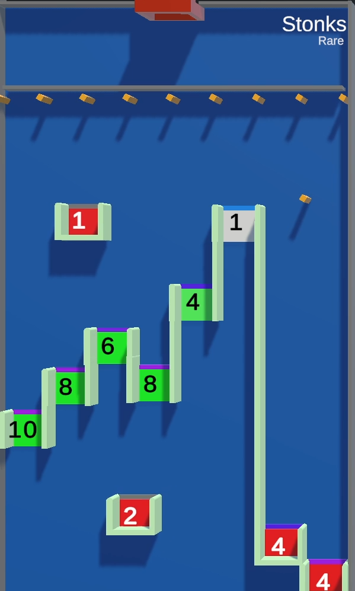

# Stonks

/// wiki | Stonks
    attrs: {class: 'inline end'}

|         |               |
|---------|---------------|
| Rarity: | Rare          |
| Input:  | None          |
| Timer:  | None          |
| Rounds: | None          |
| Slots:  | Guaranteed: 5 |
|         | Raffle: 4     |
| Added:  | v0.6 Alpha    |

///

**Stonks** is a rare minigame added in version v0.6 Alpha.

## Gameplay

The tile consists of a row of small rotating squares, below which there is a series of gaps. Above and below it there are 2 closed gaps moving diagonally.

The participating players' marbles are dropped and begin to collect points by falling through the gaps. After passing through the gap, it's point value is doubled. If a marble falls to the bottom of the tile, it appears back in the game through the pipe at the top. If a marble falls into a closed gap, it is eliminated from the game, and the given number of points is transfered to the king's balance. The negative value of closed gaps in the bottom-right corner is doubled after a marble falls into one of them.

When there's one marble left, the game ends, and the players are ranked by their elimination order. The longest surviving player wins.

/// wiki | History
|            |                |
|------------|----------------|
| v0.6 Alpha | Minigame added |
///
