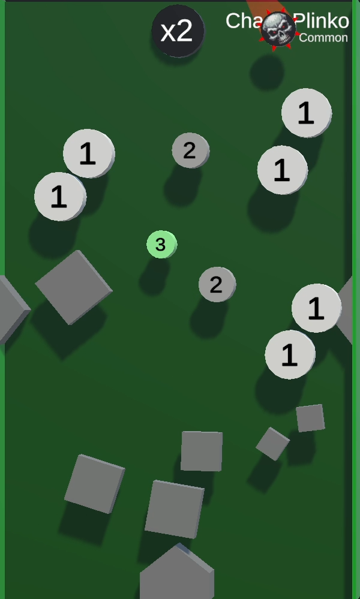
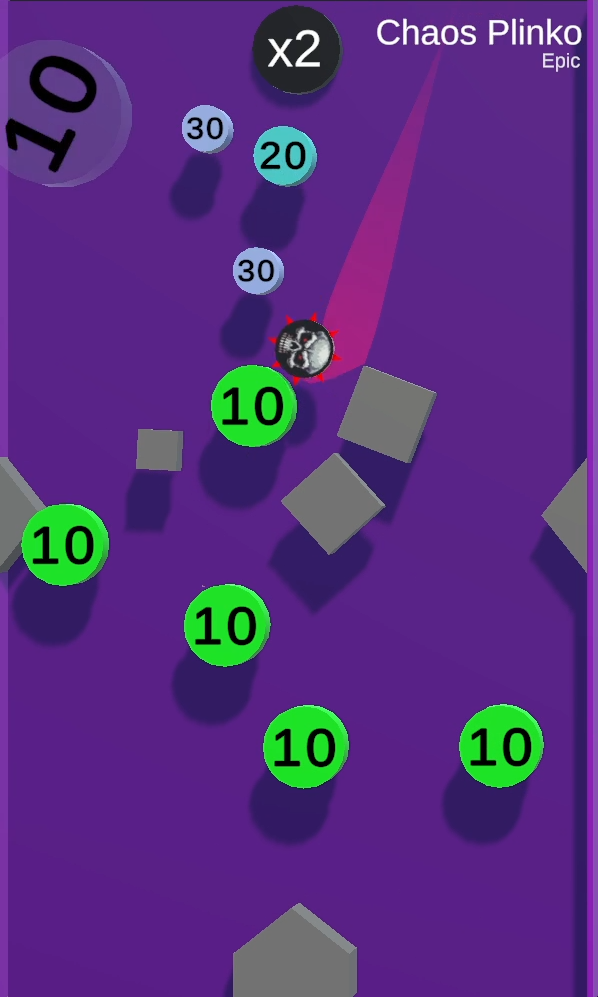

/// missing | Images missing
This wiki page lacks images of the different [tile rarities](#tile-rarities).
///

# Chaos Plinko

{{ game.info(
  slots_guaranteed = "8",
  slots_raffle     = "6",
  added            = "v0.22 Alpha",
  
  img_url = "../../../assets/images/minigames/twitch/common/chaos-plinko.png"
) }}

**Chaos Plinko** is a minigame added in v0.22 Alpha.

## Gameplay

The tile consists of various obstacles and circles, also referred to as pegs, with point values. The player marbles are dropped into the tile where they earn points by hitting the circles.  
A death bubble is also dropped into the tile. Should a player marble collide with it, they will be eliminated.

The game is over once only a single player remains. Players are listed by their survival time.

## Point multiplier and Death Ball

A point multiplier is located in the top-left corner of the tile, displaying a `x2` text. Every 15 seconds, purple text displaying `x2` fly towards the existing pegs, multiplying their value by a factor of 2.

On the 3rd, 5th and 7th to 13th multiplication is a [Death Ball](../../mechanics/death-ball.md) spawned.

## Images

### Tile rarities

/// warning |
This section requires images for rare and legendary rarity of this tile.
///

{ loading="lazy" style="max-width: 20%;" }
{ loading="lazy" style="max-width: 20%;" }

<!--
{ loading="lazy" style="max-width: 25%;" }
-->
<!--
{ loading="lazy" style="max-width: 25%;" }
-->

{{ game.history({
    'v0.22 Alpha': [
        'Minigame added'
    ],
    'v0.30 Alpha': [
      'Fix bug causing pegs to reset to 5 points.'
    ]
}) }}