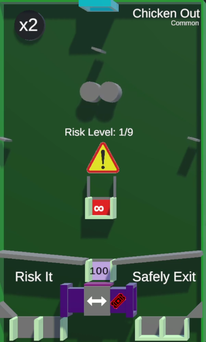

/// missing | Images missing
This wiki page lacks images of the different [tile rarities](#tile-rarities).
///

# Chicken out

{{ game.info(
  inputs           = "Bidding tickets to change Pipe exit.",
  slots_guaranteed = "8",
  slots_raffle     = "8",
  added            = "v0.29 Alpha",
  
  img_url = "../../../assets/images/minigames/twitch/common/chicken-out.png"
) }}

**Chicken out** is a minigame tile added in v0.29 Alpha of the game where the player can chose when to exit the tile by bitting a spawn ticket.

## Gameplay

At the top is a rotating paddle followed by two fast moving circles, two additional rotating paddles, a closed gaps with two small walls above itself, a gap with two up and down moving paddles funneling into it and a splitting point pointing into two sets of gaps, one open and one closed.

When the game starts will all players be dropped in at the top and fall through the tile. Should they hit the gap near the center will they be eliminated and lose all points. Should they make it to the bottom gap will they earn points before ending in the splitting pipe. Said pipe will always drop players to the left, unless they bit at least one spawn ticket in which case they are dropped to the right.  
Players droped on the left will fall through gaps and spawn back at the top, repeating the cycle. Players droped on the right will have one ticket removed and be eliminated. Neither gap gives or takes point.

The tile has a visible "Risk Level" that increases with each point multiplication and can go up to level 9. For every level, the two walls above the infinity gap become triangles and increase in width. At level 9 will they cover as much space that only one marble may fit between them and the wall. Level increases with each point multiplication.

## Point multiplier and Death Ball

A point multiplier is located in the top-left corner of the tile, displaying a `x2` text. Every 15 seconds, purple text displaying `x2` fly towards the bucket in the center, multiplying its value by a factor of 2.

Only on the 20th multiplication is a [Death Ball](../../mechanics/death-ball.md) spawned.

## Images

### Tile rarities

/// warning |
This section requires images for rare, epic and legendary rarity of this tile.
///

No images yet.

{ loading="lazy" style="max-width: 20%;" }
<!-- No images yet.
{ loading="lazy" style="max-width: 20%;" }
{ loading="lazy" style="max-width: 20%;" }
{ loading="lazy" style="max-width: 20%;" }
-->

{{ game.history({
  'v0.29 Alpha': [
    'Minigame added'
  ],
  'v0.30 Alpha': [
    'Clarified how to safely exit chicken out',
    'Max risk level is now displayed to show when it is done increasing',
    'Added warning sign to further indicate about the risk of losing all points'
  ]
}) }}