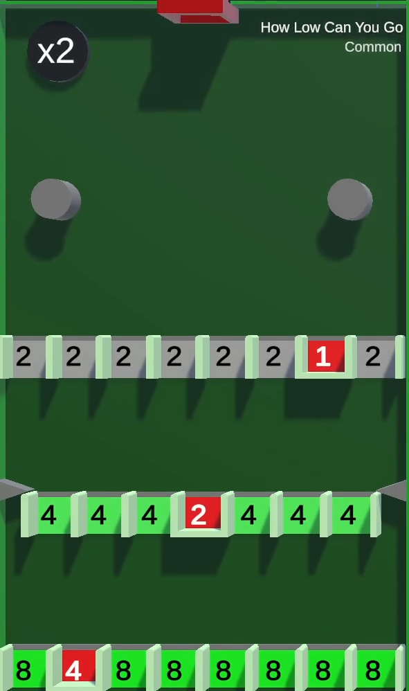
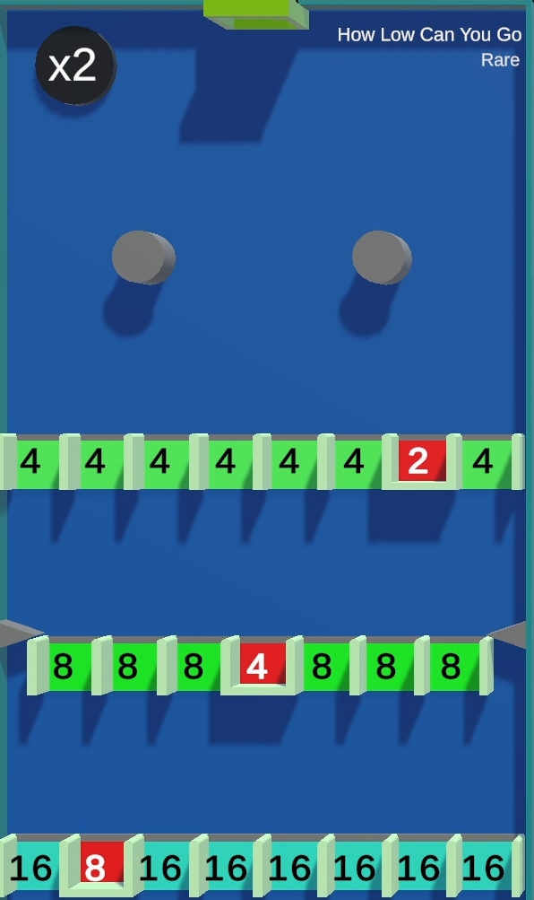
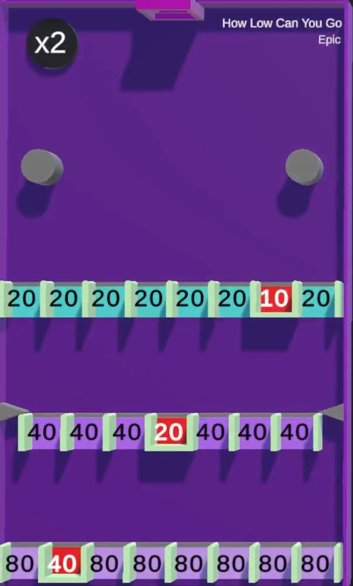

{{ game.yt_version("common/how-low-can-you-go/") }}

/// missing | Images missing
This wiki page lacks images of the different [tile rarities](#tile-rarities).
///

# How Low Can You Go

{{ game.info(
  slots_guaranteed = "8",
  slots_raffle     = "4",
  added            = "v0.1 Alpha",
  
  img_url = "../../../assets/images/minigames/twitch/common/how-low-can-you-go.png"
) }}

**How Low Can You Go** is a minigame added in version v0.1 Alpha. It is based on the YouTube version's [tile of the same name](../../youtube-minigames/common/how-low-can-you-go.md).

## Gameplay

The tile consists of 2 circles moving horizontally, below which there are 3 rows with several gaps and buckets.

The player marbles are dropped from the pipe at the top into the tile after which they will find their way through open gaps or closed buckets with point values displayed.  
If the player ends up in a bucket, the displayed point value will get removed from them and transferred to the current king while their marble also gets eliminated. Falling through a gap gives the player the displayed point value.

Each row has one bucket with gaps filling the remaining area. The first row has gaps with an initial point value of 2 and a bucket with an initial point value of 2. The second row has the values of the first row doubled and the 3rd row has its point values doubled from the 2nd row.

Once the player reaches the bottom of the tile, they will reappear at the top at the location of the pipe, repeating the circle.

## Point multiplier and Death Ball

A point multiplier is located in the top-left corner of the tile, displaying a `x2` text. Every 15 seconds, purple text displaying `x2` fly towards the buckets, multiplying their values by a factor of 2.

Starting with the 3rd multiplication, a [Death Ball](../../mechanics/death-ball.md) is spawned every subsequent multiplication.

## Images

### Tile rarities

/// warning |
This section requires images for legendary rarity of this tile.
///

{ loading="lazy" style="max-width: 20%;" }
{ loading="lazy" style="max-width: 20%;" }
{ loading="lazy" style="max-width: 20%;" }

<!-- No images yet.
{ loading="lazy" style="max-width: 20%;" }
-->

{{ game.history({
  'v0.1 Alpha': [
    'Minigame added'
  ],
  'v0.16 Alpha': [
    '(Experimental) Gaps now increase in value every time a player passes through'
  ],
  'v0.17 Alpha': [
    'Nerfed survival rate'
  ],
  'v0.22 Alpha': [
    'Minigame can now appear in any rarity',
    'Minigame buffed'
  ],
  'v0.24 Alpha': [
    'Added sudden death doubler'
  ]
}) }}