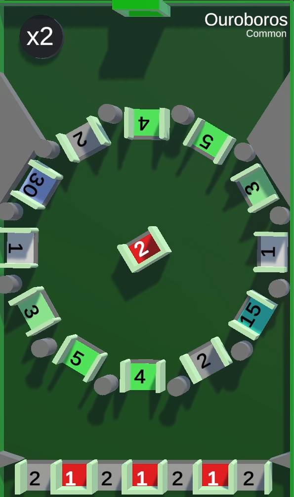
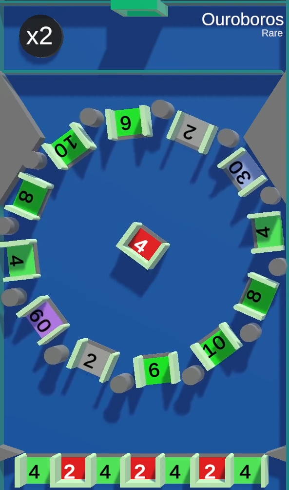

/// missing | Images missing
This wiki page lacks images of the different [tile rarities](#tile-rarities).
///

# Ouroboros

{{ game.info(
  slots_guaranteed = "8",
  slots_raffle     = "8",
  added            = "v0.18 Alpha",
  
  img_url = "../../../assets/images/minigames/twitch/common/ouroboros.png"
) }}

**Ouroboros** is a minigame added in version v0.18 Alpha. It's based on the YouTube version of the same name.

## Gameplay

The tile contains a circle made up of gaps and small pillars rotating counter-clockwise. In the center is a closed gap slowly rotating clockwise. At the bottom is a row of gaps, some of which are closed.

The common tile has the following values at the start of the game:

- Circle: 2x 1, 2x 2, 2x 3, 2x 4, 2x 5, 1x 15 and 1x 30 points gaps.
- Center gap: -2 points bucket.
- Bottom row: 4x 2 points gap and 3x -1 point bucket alternating.

Each rarity doubles the initial values of the board.

Gaps will only change their values through the [multiplier](#point-multiplier)

## Point Multiplier

A point multiplier is located at the top left of the tile, displaying x2.
Every 10 seconds, it will increase the point values of the gaps and buckets by a factor of 2. Every 3rd multiplication, a [death ball](../../mechanics/death-ball.md) will be spawned underneath the multiplier, eliminating every player that touches its spikes when exposed.

## Images

### Tile rarities

/// warning |
This section requires images for epic and legendary rarity of this tile.
///

{ loading="lazy" style="max-width: 20%;" }
{ loading="lazy" style="max-width: 20%;" }
<!-- No images yet.
{ loading="lazy" style="max-width: 20%;" }
{ loading="lazy" style="max-width: 20%;" }
-->

{{ game.history({
  'v0.18 Alpha': [
    'Minigame Added'
  ],
  'v0.19 Alpha': [
    'Increased death rate',
    'Nerfed point earnings'
  ],
  'v0.22 Alpha': [
    'Minigame can now appear in any rarity',
    'Minigame buffed'
  ],
  'v0.24 Alpha': [
    'Added sudden death doubler'
  ]
}) }}