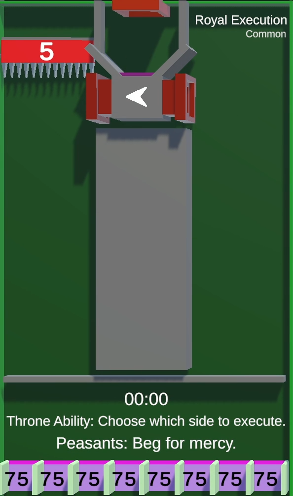
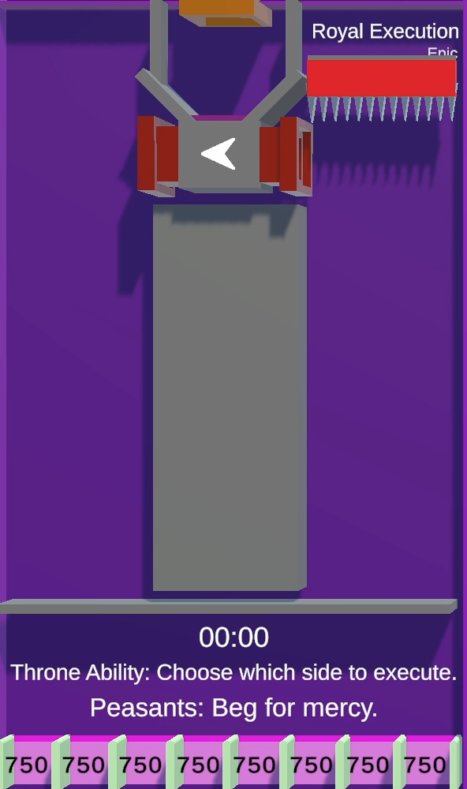

/// missing | Images missing
This wiki page lacks images of the different [tile rarities](#tile-rarities).
///

# Royal Execution

{{ game.info(
  inputs           = "King&#58; [`!left`][left-command], [`!right`][right-command]",
  timer            = "30 seconds",
  rounds           = "1-3",
  slots_guaranteed = "6",
  slots_raffle     = "2",
  added            = "v0.8 Alpha",
  
  img_url = "../../../assets/images/minigames/twitch/common/royal-execution.png"
) }}

**Royal Execution** is a minigame added in version v0.8 Alpha.

## Gameplay

The tile consists of 2 sides separated by a triangle shape that is open at the top. A splitting pipe at the top splits the players to the left and right, always alternating between the sides with each player entering it.

A row of spikes is located at the top on either the left or right side.  
After players have been distributed will a 30 second countdown start during wich the current king can choose a side to eliminate using the [`!left`][left-command] or [`!right`][right-command] respectively. During this time can the players throw tomatoes at each other, or themself, to throw them in the air and try to move into the other area.

Once the timer is up will the spikes move down, eliminating all players on its side and take points from that. Should more than 1 player remain will the floor below them disappear and they will be droped into the row of gaps to earn points, before reappearing at the top, being distributed again through the splitting pipe.

This loop repeats until all or all but one player got eliminated.

## Trivia

- It is actually possible to die to the spikes when exiting the forking pipe, if your marble happens to have the right velocity.

## Images

### Tile rarities

/// warning |
This section requires an image for the legendary rarity of this tile.
///

{ loading="lazy" style="max-width: 20%;" }
{ loading="lazy" style="max-width: 20%;" }
{ loading="lazy" style="max-width: 20%;" }
<!-- No images yet.
{ loading="lazy" style="max-width: 20%;" }
-->

{{ game.history({
  'v0.8 Alpha': [
    'Minigame added'
  ],
  'v0.9 Alpha': [
    'Timer increased to 30 seconds'
  ],
  'v0.14 Alpha': [
    'Fixed bug causing commands from king to not be registered'
  ],
  'v0.33 Alpha': [
    'Moved platform back on the z-layer to avoid obstructing player points',
    'Simplified wording'
  ],
  'v0.34 Alpha': [
    'Player points show above the platform (For real this time)'
  ],
  'v0.35 Alpha': [
    'Player points show above the platform (3rd time is the charm)'
  ],
  'v0.36 Alpha': [
    'Reduced ejection speed of pipe'
  ]
}) }}