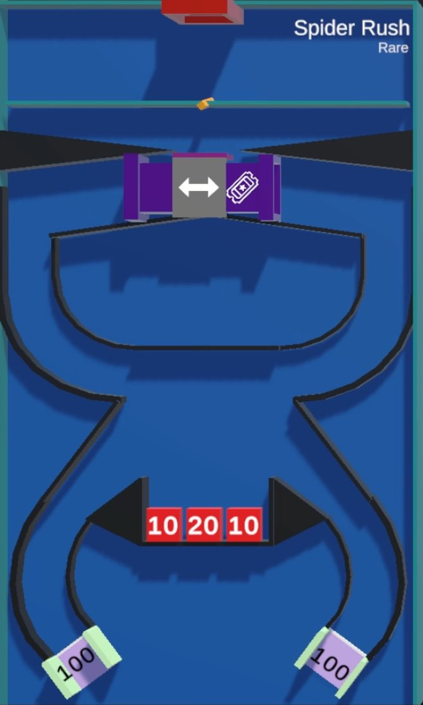

/// missing | Images missing
This wiki page lacks images of the different [tile rarities](#tile-rarities).
///

# Zero or Hero

{{ game.info(
  rarity           = ["rare"],
  inputs           = "Bidding tickets to change Pipe exit.",
  slots_guaranteed = "8",
  slots_raffle     = "8",
  added            = "v0.35 Alpha",
  
  img_url = "../../../assets/images/minigames/twitch/rare/spider-rush.png"
) }}

**Spider Rush** is a game introduced in v0.35 Alpha of Chaos League and is based on the YouTube version of the same name.

## Gameplay

The tile contains a structure looking similar to a spider or an hour glass with three negative point blocks near the bottom center, a special splitting pipe at the top and two point gaps, both 50 points, at the bottom.  
Using tickets, a player can choose if they want to be ejected to the right side of the splitting pipe, or to the left (Default if no tickets are bid). Players will move down the first part of the structure, entering a cross section, where they can collide and eventually fall into the negative point blocks, eliminating them in the process while removing points depicted on the blocks.  
Should they manage to get through the cross section will they end up at a gap that will give them points, while also eliminating them. Unlike other gaps in the game will these one count down with each player passing. Whether it is possible for the gap to go into the negatives and remove points from a player passing it is yet unknown.

The game ends once all but one player got eliminated.

## Images

### Tile rarities

{ loading="lazy" style="max-width: 25%;" }

{{ game.history({
  'v0.35 Alpha': [
    'Minigame added'
  ],
  'v0.36 Alpha': [
    'Added Death Ball to timeout game after 2 minutes',
    'Fixed buckets not resetting, causing them to eliminate players while positive'
  ]
}) }}