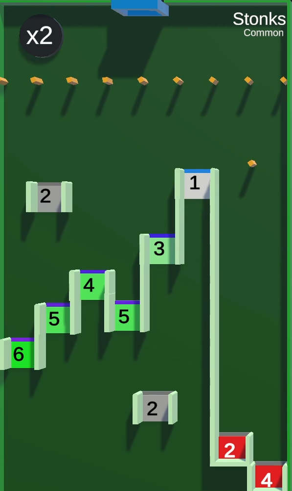

/// missing | Images missing
This wiki page lacks images of the different [tile rarities](#tile-rarities).
///

# Stonks

{{ game.info(
  slots_guaranteed = "5",
  slots_raffle     = "4",
  added            = "v0.6 Alpha",
  
  img_url = "../../../assets/images/minigames/twitch/common/stonks.png"
) }}

**Stonks** is a minigame added in version v0.6 Alpha.

## Gameplay

The tile consists of a row of small rotating pins, below which there is a series of gaps. Above and below it there are 2 slowly moving gaps.

The players are dropped at the top from the pipe into the tile after which they make their way through the row of rotating pins.  
If they end up at the right, they will fall down into one of the two buckets, eliminating them while also transferring the displayed point value from them to the king.

Falling through any other gap will give the player the displayed point value. Falling through any gap not having a grey line at the top will make it increase its value by a certain factor based on its line color.

After falling through any gap, they will fall to the bottom of the tile after which they reappear at the top at the location of the pipe.

## Point multiplier and Death Ball

A point multiplier is located in the top-left corner of the tile, displaying a `x2` text. Every 15 seconds, purple text displaying `x2` fly towards the buckets, multiplying their values by a factor of 2.

On the 3rd, 6th, 8th and 10th to 13th multiplication, a [Death Ball](../../mechanics/death-ball.md) is spawned.

## Images

### Tile rarities

/// warning |
This section requires images for epic and legendary rarity of this tile.
///

{ loading="lazy" style="max-width: 20%;" }
{ loading="lazy" style="max-width: 20%;" }
<!-- No images yet.
{ loading="lazy" style="max-width: 20%;" }
{ loading="lazy" style="max-width: 20%;" }
-->

{{ game.history({
  'v0.6 Alpha': [
    'Minigame added'
  ],
  'v0.22 Alpha': [
    'Minigame can now appear in any rarity'
  ],
  'v0.24 Alpha': [
    'Added sudden death doubler'
  ],
  'v0.31 Alpha': [
    'Fixed bug causing axis of spinning pegs to shift after long streams'
  ]
}) }}