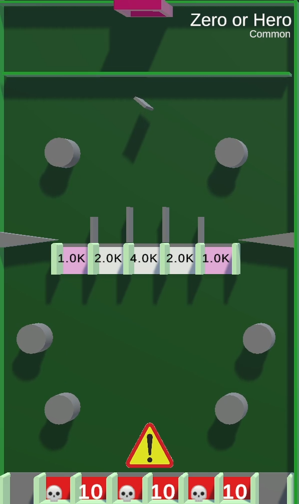
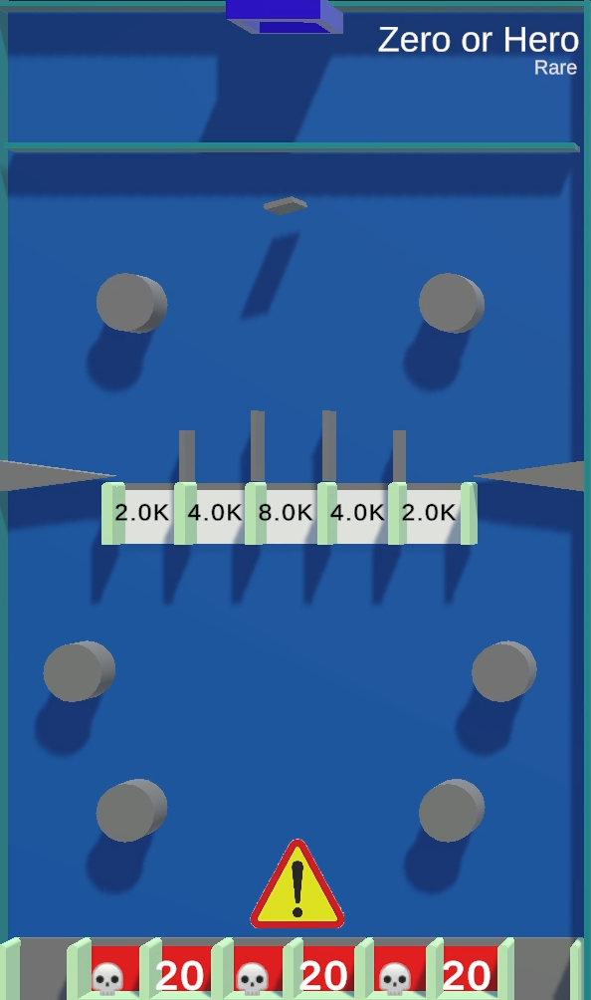
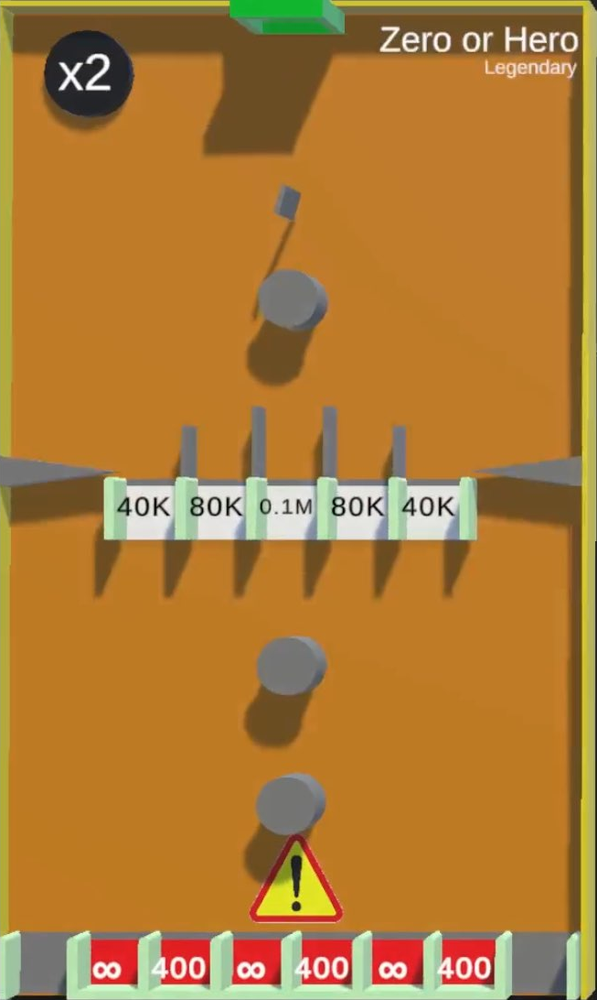

# Zero or Hero

{{ game.info(
  slots_guaranteed = "8",
  slots_raffle     = "2",
  added            = "v0.9 Alpha",
  
  img_url = "../../../assets/images/minigames/twitch/common/zero-or-hero.png"
) }}

**Zero or Hero** is a minigame added in v0.9 Alpha. It is based on the YouTube version's tile of the same name.

## Gameplay

The tile consists of 2 circles moving horizontally, a row of gaps with high point values, another 4 circles and another row of gaps.

The participating players' marbles are dropped and begin to collect points by falling through the gaps in the first row. If a marble falls through the outside gaps in the second row, it appears back in the game through the pipe at the top. If a marble falls into one of the closed gaps, it is eliminated from the game. If that gap had a skull icon, all of the player's balance is transferred to the king. Otherwise, the player transfers just 10 points.

When there's one marble left, the game ends and the players are ranked by their elimination order. The longest surviving player wins.

## Images

### Tile rarities

/// warning |
This section requires images for epic and legendary rarity of this tile.
///

{ loading="lazy" style="max-width: 20%;" }
{ loading="lazy" style="max-width: 20%;" }

<!-- No images yet.
{ loading="lazy" style="max-width: 20%;" }
{ loading="lazy" style="max-width: 20%;" }
-->

{{ game.history({
  'v0.9 Alpha': [
    'Minigame added'
  ],
  'v0.10 Alpha': [
    'Danger sign added to further hint at the possible risk of losing all your points'
  ],
  'v0.22 Alpha': [
    'Minigame can now appear in any rarity',
    'Minigame buffed'
  ],
  'v0.25 Alpha': [
    'Changed skull textures to infinity symbols'
  ],
  'v0.26 Alpha': [
    'Max players changed to 16',
    'Game now starts a countdown even while empty and skips if no player joins',
    'Enabled sudden death'
  ]
}) }}