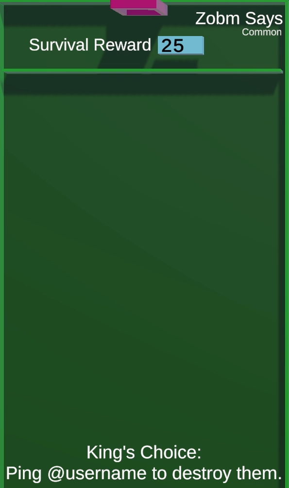
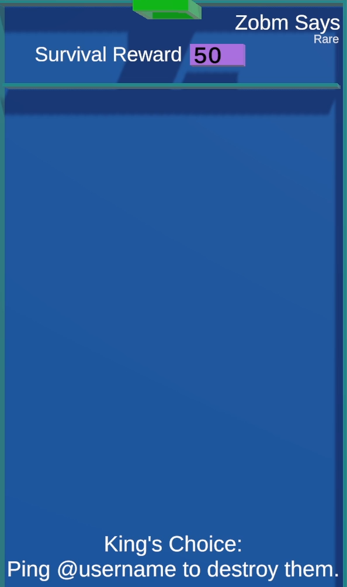

/// missing | Images missing
This wiki page lacks images of the different [tile rarities](#tile-rarities).
///

# Zobm Says

{{ game.info(
  inputs           = "King&#58; `@mention` user",
  slots_guaranteed = "3",
  slots_raffle     = "2",
  added            = "v0.26 Alpha",
  
  img_url = "../../../assets/images/minigames/twitch/common/zobm-says.png"
) }}

**Zobm Says** is a minigame tile where the king controls the game and chooses the order in which to eliminate the players.

## Gameplay

The players are moved into a tile similar in design to [Quip Battle].  
A countdown starts during which the current king can eliminate the players by mentioning them in chat.

Every time the king eliminates a player, a sound effect is played, the mentioned player loses points and gets eliminated, and all remaining players receive points. In addition are the points a player can earn or lose doubled after each elimination.

The game is over when all but one player got eliminated.  
Players are ranked based on elimination order, with first eliminated being lowest.

## Trivia

- The name of this tile is a reference to the stream participant Mr_Zobm, who is known for gifting hundreds of twitch subscriptions and spending a lot of bits, most of them for spawning lava.

## Images

### Tile rarities

/// warning |
This section requires images for epic and legendary rarity of this tile.
///

{ loading="lazy" style="max-width: 20%;" }
{ loading="lazy" style="max-width: 20%;" }

<!-- No images yet.
{ loading="lazy" style="max-width: 20%;" }
{ loading="lazy" style="max-width: 20%;" }
-->

{{ game.history({
    'v0.26 Alpha': [
        'Minigame added'
    ],
    'v0.28 Alpha': [
      'Timer increased',
      'Eliminated players now lose points and points lost and given double with each elimination'
    ],
    'v0.33 Alpha': [
      'Added warning Sign',
      'Changed "Survival reward" to "Reward/Punishment"'
    ]
}) }}
