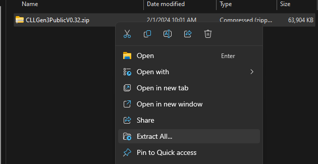
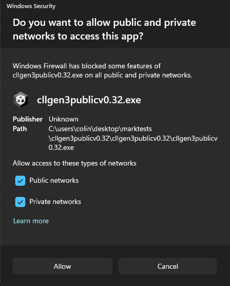
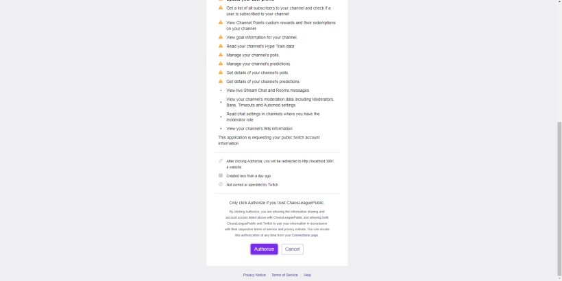
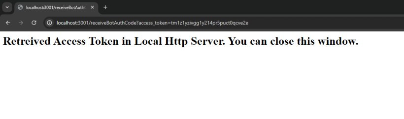

# Stream it yourself

/// info
This page only applies to v0.32 Alpha of the Gen 3 Twitch version of the game.
///

Chaos League can be easily streamed by Twitch streamers themself. To do this, follow the below guide.

## Requirements

To run the game, you first need to meet certain requirements, namely:

- You use Windows. Chaos League only supports Windows right now.
- You are a Twitch afiliate or have access to a Twitch afiliate channel.
    The game relies on Twitch's channel point system which are only available for afiliates. [[Affiliate Requirements](https://help.twitch.tv/s/article/twitch-affiliate-program-faq?language=en_US)]

## Setup

1. Go to [this Patreon Post](https://www.patreon.com/posts/download-chaos-3-97651885) and download the attachment of it to your PC.
2. Extract the downloaded Zip file's content.
    
    { loading="lazy" }

3. **[Optional]** Customize the Point sprite.
    - Navigate to the `StreamingAssets` folder (`CLLGen3PublicV0.32/CLLGen3PublicV0.32_Data/StreamingAssets/`)
    - Replace `communityPointSprite.png` with your own PNG file. The file must be the same dimension!
4. Double-click the `CLLGen3PublicV0.32.exe` file to start the game.
5. Grant access for public and private networks for the app.
    
    { loading="lazy" }
    
6. A popup should appear on your browser where you get asked to authorize ChaosLeaguePublic using your Twitch account. You may need to first login into your Twitch account. Authorize the requested permissions to allow the game to run automatically.
    
    { loading="lazy" }
    
7. After authorizing should you be redirected to this window:
    
    { loading="lazy" }
8. You are done! The available channel point rewards should be generated for you automatically. Press escape to access the Settings UI of the game.
    - This menu allows things such as connecting to Spotify using your Spotify account.
