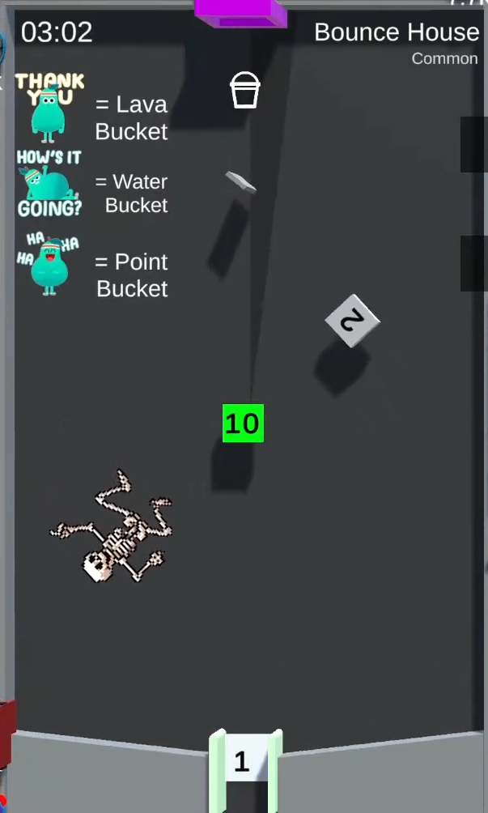

# Bounce House

/// wiki | Bounce House
    attrs: {class: 'inline end'}

|         |                               |
|---------|-------------------------------|
| Rarity: | Common                        |
| Pipes:  | 1                             |
| Timer:  | 188 seconds                   |
| Added:  | v2.6                          |

///

**Bounce House** is a common minigame added in version v2.6. A [similar tile](../../twitch-minigames/common/bounce-house.md) has been later added in the Twitch version.

## Gameplay

The tile consists of a 10 points block in it's center, a 2 point block and a skeleton image rotating around it and 2 moving structures with a 1 point gap between them. Just under the pipe, there's a small, rotating rectangle.

The participating players' marbles are dropped and begin to fly around the tile, launched by the moving structures. If a marble touches one of the blocks, it's points value is added to it's balance. If a marble falls through, 1 points are added to it's balance and it appears back in the queue.

## See also

- [Bounce House](../../twitch-minigames/common/bounce-house.md) - Twitch version