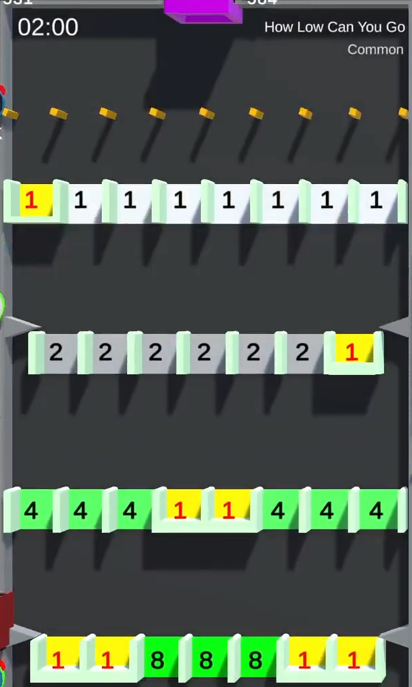

{{ game.twitch_version("minigames/how-low-can-you-go/") }}

# How Low Can You Go

/// wiki | How Low Can You Go
    attrs: {class: 'inline end'}

|                             |                                    |
|-----------------------------|------------------------------------|
| Rarity { .draw_line--down } | Common { .draw_line--down }        |
| Pipes { .draw_line--down }  | 1 { .draw_line--down }             |
| Timer { .draw_line--down }  | 120 seconds { .draw_line--down }   |
| Added { .draw_line--down }  | v2.0 Alpha #1 { .draw_line--down } |

///

**How Low Can You Go** is a common minigame added in version v0.1 Alpha. A [similar tile](../../twitch-tiles/minigames/how-low-can-you-go.md) has been later added in the Twitch version.

## Gameplay

The tile consists of a row of small rotating squares, below which there are 4 rows with several gaps.

The participating players' marbles are dropped and begin to collect points by falling through the gaps. If a marble falls through the last row, it appears back in the queue. If a marble falls into a closed gap, it is despawned, and the given number of points is transferred to the king's balance.

{{ game.history(
  versions = {
    'v2.0 Alpha #1': [
      'Minigame added'
    ]
  }
) }}